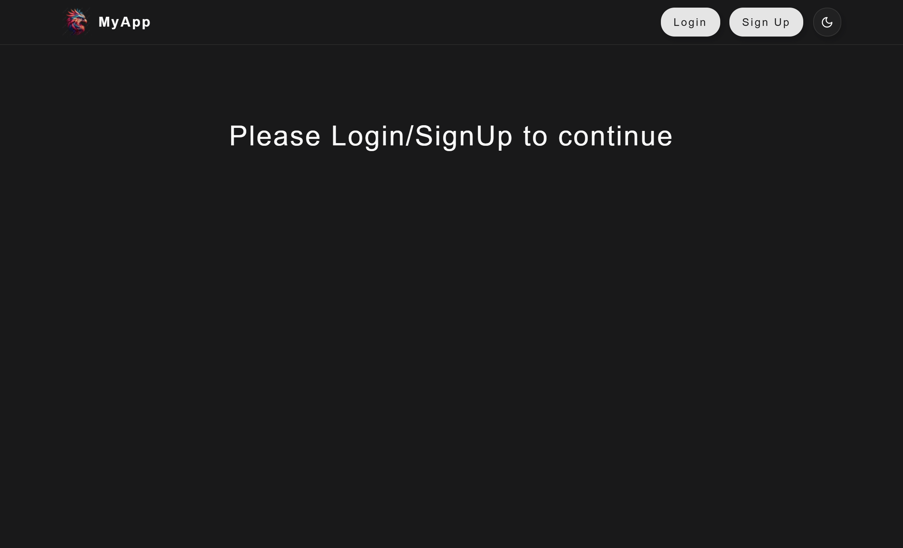
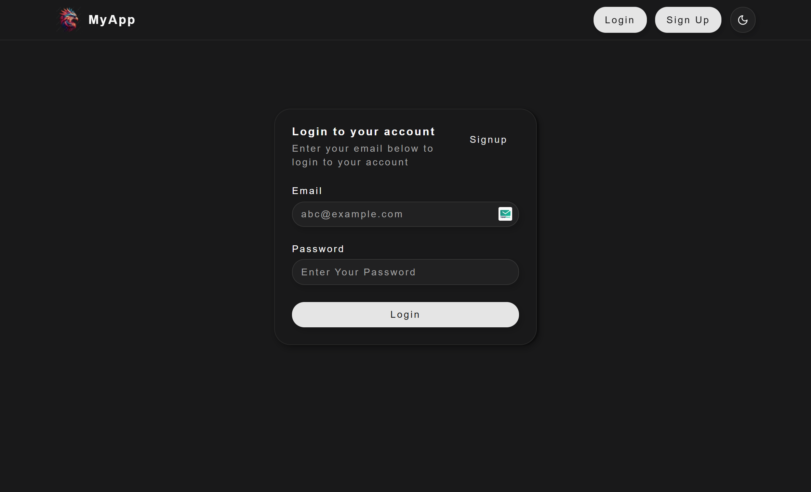
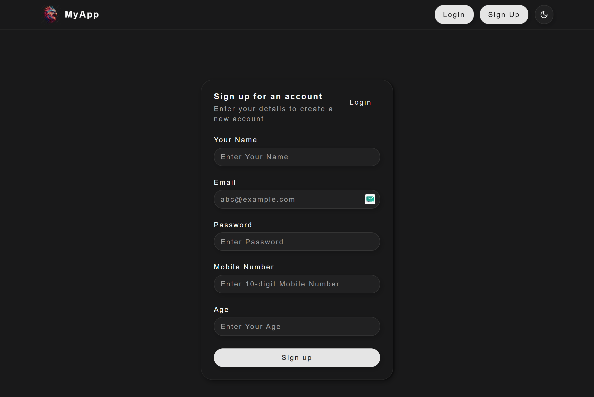
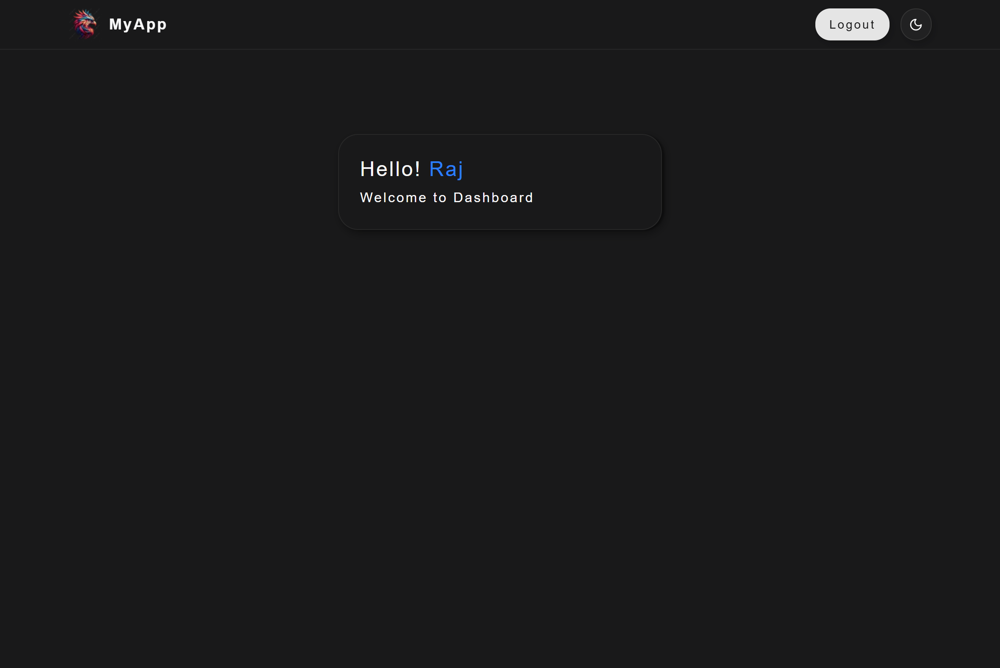

# 🔐 Authentication with Next.js, TypeScript, ShadCN UI, and Appwrite

This project is a modern authentication system built using **Next.js (App Router)**, **TypeScript**, **ShadCN UI**, and **Appwrite**. It supports **sign up**, **login**, **logout**, **session-based user context**, and **Google OAuth**, all styled with ShadCN UI and deployed via **Vercel**.

## 🚀 Live Preview 👉 [View Live](https://authentication-app-in-next-js.vercel.app)

---

## 📁 Features

- 🔑 **Sign up and login with email/password**
- 🧠 **Context-based user session management**
- 🔄 **Persistent login after refresh**
- ⚙️ **Logout functionality**
- 🌐 **Google OAuth (optional)**
- 🧭 **Routing with App Router & Middleware**
- ✨ **Responsive UI with ShadCN**
- ☁️ **Deployed to Vercel**

---

## 🚀 How to Run Locally

### 1. Clone the repo

```bash
git clone https://github.com/raj-0508/authentication-nextjs-appwrite
cd authentication-nextjs-appwrite
```

### 2. Install dependencies

```bash
npm install
```

### 3. Set up `.env.local`

```env
NEXT_PUBLIC_APPWRITE_ENDPOINT=https://cloud.appwrite.io/v1
NEXT_PUBLIC_APPWRITE_PROJECT_ID=your-project-id
```

> Replace the values above with your actual Appwrite credentials.

### 4. Start the development server

```bash
npm run dev
```

---

## 🧠 What I Learned

- ✅ Integrated **Appwrite** into a Next.js TypeScript project
- 🔄 Managed global session with **React Context**
- 🔐 Protected routes using **middleware.ts**
- 🎨 Built modern, accessible UIs with **ShadCN UI**
- ☁️ Configured **CORS and Web Platforms** in Appwrite
- 🚀 Deployed project on **Vercel** with proper rewrites

---

## 🧰 Tech Stack

- Next.js (App Router)
- TypeScript
- Appwrite
- ShadCN UI
- Tailwind CSS
- Vercel

---

## 📸 Screenshots






---

## 📫 Feedback

If you find this helpful or have suggestions, feel free to open issues or connect!

> Made with ❤️ by Raj Singhaniya
